<table>
<tr>
<td valign="top"></td>
<td valign="top"></td>
</tr>
</table>

## Rayan El Habib

**IT Developer · Full Stack Engineer · Open Source Contributor**

<!-- animated contribution graph, refreshed daily by the workflow -->

# Skills  

| Category        | Skills        |
|-----------------|---------------|
| Frameworks|       |
| Languages       |         |
| Styling & Frameworks |      |
| Database |       |
| Services & Tools|     |
| Competitive Coding |    |
| IDE & Environment |       |
| Hosting         |      |
| APIs |     |
| Design Tools    |    |
| Learning |      |

 

<picture>
  <source media="(prefers-color-scheme: dark)" srcset="https://raw.githubusercontent.com/tobiasmeyhoefer/tobiasmeyhoefer/output/github-snake-dark.svg" />
  <source media="(prefers-color-scheme: light)" srcset="https://raw.githubusercontent.com/tobiasmeyhoefer/tobiasmeyhoefer/output/github-snake.svg" />
  
</picture>
